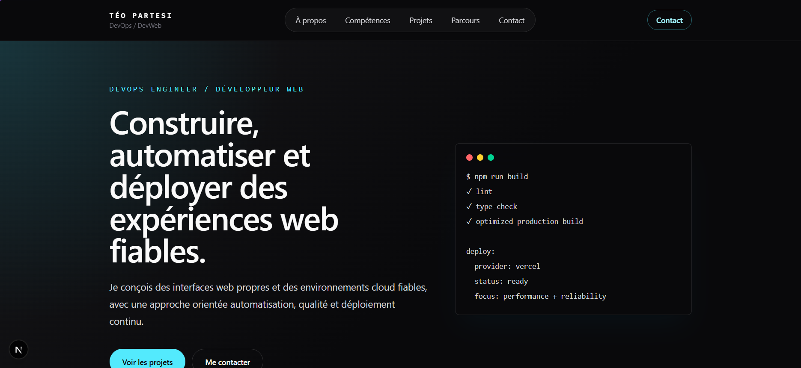

<!-- ========================= -->
<!-- Header -->
<!-- ========================= -->

<div align="center">


# 🚀 Portfolio

## Développeur Full Stack • DevOps • Cloud

Un portfolio moderne développé avec **Next.js**, **TypeScript** et **Tailwind CSS**.

<br>

[🌐 Site en ligne](https://teopartesi.fr/) • [👔 LinkedIn](https://www.linkedin.com/in/t%C3%A9o-partesi/) • [📷 Instagram](https://www.instagram.com/teo_partesi/)

<br>


</div>

---

## 📸 Aperçu

<p align="center">

</p>

---

## ✨ Fonctionnalités

- 🎨 Design moderne
- 📱 Responsive
- ⚡ Performance optimisée
- 🌙 Dark Mode
- 📂 Présentation des projets
- 📧 Formulaire de contact

---

## 🛠️ Technologies

| Front-end | Back-end | DevOps |
|-----------|-----------|---------|
| Next.js 16 | Node.js | GitHub Actions |
| React 19 | | Docker |
| TypeScript | | GHCR |
| Tailwind CSS | | Kubernetes |

---

## 🚀 Installation

```bash
git clone https://github.com/teopartesi/portfolio.git

cd portfolio

mise install

mise exec -- npm ci

mise exec -- npm run dev
```

Le dépôt épingle Node.js 24.18.0 et npm 11.16.0 dans `mise.toml`. Utiliser
`mise exec --` évite qu'une autre version globale de Node.js ou de npm soit
employée par inadvertance.

---

## 📁 Structure

```text
portfolio/
│
├── app/
├── components/
├── docs/
├── k8s/
├── lib/
├── public/
├── Dockerfile
├── compose.yaml
├── package.json
└── README.md
```

---

## 📚 Documentation

- [Docker](./docs/DOCKER.md)
- [Déploiement](./docs/DEPLOYMENT.md)
- [Infrastructure](./docs/INFRASTRUCTURE.md)
- [Traefik](./docs/TRAEFIK.md)
- [Roadmap](./docs/ROADMAP.md)

---

## 👤 Auteur

**Téo Partesi**

- [👔 LinkedIn](https://www.linkedin.com/in/t%C3%A9o-partesi/)
- [💻 GitHub](https://github.com/teopartesi/portfolio)
- [🌿 Portfolio](https://teopartesi.fr/)
- [📷 Instagram](https://www.instagram.com/teo_partesi/)
