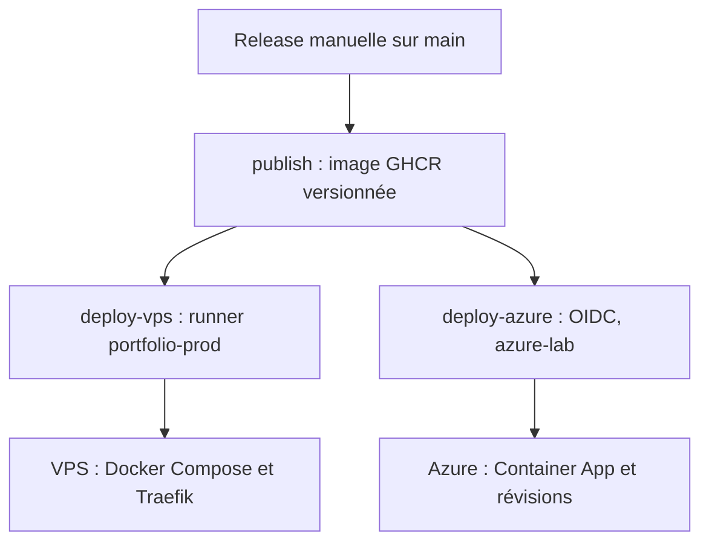

# 🏗 Infrastructure

Ce document décrit l'infrastructure utilisée pour héberger le portfolio.

| Cible | Statut | Exécution | Accès |
|-------|--------|-----------|-------|
| VPS Scaleway | Production, déploiement actif | Docker Compose + Traefik | `https://teopartesi.fr` |
| Azure Container Apps | Lab, déploiement actif via `azure-lab` | Container App et révisions managées | FQDN de la Container App |
| Kubernetes/k3s | Préparation, hors pipeline actif | Manifests dans `k8s/` | Ingress à configurer |

---

## Distribution de l'image vers les deux cibles



`release.yml` appelle `deploy.yml` lorsqu'une version Semantic Release est
créée. `publish` construit au tag Git `v<version>` et publie
`ghcr.io/teopartesi/portfolio:<version>` ainsi que `latest`. Les jobs
`deploy-vps` et `deploy-azure` dépendent tous deux de `publish` et peuvent
s'exécuter en parallèle. Ils déploient le tag de version sans `v`.

Le VPS reste la production derrière `teopartesi.fr` ; le lab Azure est une
seconde destination de la même release, pas une étape de préproduction qui
bloque sa promotion. Un échec ou un rollback sur une cible n'annule pas l'autre.

## Architecture active Docker/Traefik

Le DNS Scaleway de `teopartesi.fr` pointe vers `51.159.24.182`. Traefik reçoit
le trafic HTTP/HTTPS sur le VPS Ubuntu et le transmet au conteneur Next.js sur
le port `3000`, via le réseau Docker `proxy`.

Le runner GitHub Actions auto-hébergé porte les labels
`[self-hosted, Linux, x64, portfolio-prod]`. Il récupère l'image sur GHCR et
met à jour `/opt/docker/compose/portfolio/compose.yaml` et `.env`, puis relance
la stack Docker Compose. Le déploiement ne passe plus par une connexion SSH
depuis un runner hébergé par GitHub.

## Architecture active Azure Container Apps

| Élément | Configuration du pipeline |
|---------|---------------------------|
| Job et runner | `deploy-azure`, `ubuntu-latest` |
| Environnement GitHub | `azure-lab` |
| Groupe de ressources | `rg-portfolio-cloud-lab` |
| Container App | `ca-portfolio-lab-hello` |
| Image déployée | `ghcr.io/teopartesi/portfolio:<version>` |
| Mise à jour | `az containerapp update --image` |

La Container App s'exécute dans un environnement managé Azure déjà provisionné.
Le nom `azure-lab` désigne l'environnement GitHub qui porte les secrets et les
règles de déploiement ; le workflow ne définit pas le nom de l'environnement
managé Azure. Les ressources, l'ingress HTTP/HTTPS vers le port cible `3000`
et les règles de mise à l'échelle doivent être configurés au préalable.

Les visiteurs utilisent le FQDN de la Container App. L'ingress Azure transmet
les requêtes aux réplicas des révisions sélectionnées par les règles de trafic.
Le workflow ne change ni le DNS `teopartesi.fr`, ni le routage du VPS. Docker
Compose, Traefik et le réseau `proxy` sont propres au VPS.

### Identité et registre

`azure/login@v3` utilise OIDC et la permission `id-token: write`, autorisée
aussi par le job appelant dans `release.yml`. L'environnement GitHub
`azure-lab` fournit `AZURE_CLIENT_ID`, `AZURE_TENANT_ID` et
`AZURE_SUBSCRIPTION_ID`. L'identité Entra doit faire confiance au sujet OIDC
du job lié à cet environnement et disposer des droits Azure RBAC sur le lab.
Aucun secret client Azure n'est utilisé. Les détails de fédération figurent
dans [DEPLOYMENT.md](./DEPLOYMENT.md#environnement-azure-lab-et-oidc).

GHCR reste le registre commun ; aucun registre ACR n'est ajouté par ce flux.
Le pipeline ne fournit pas d'identifiants GHCR à Azure : l'image doit être
publique ou l'authentification du registre privé doit déjà être configurée
sur la Container App. OIDC Azure et l'accès à GHCR sont deux authentifications
distinctes.

### Révisions et retour arrière

Le changement d'image crée une révision Azure. Le job affiche l'image du
modèle courant, `latestRevisionName` et `latestReadyRevisionName`, sans test
HTTP ni rollback automatique. Il conserve le mode des révisions et les poids
de trafic existants ; ces paramètres ne sont pas déclarés dans le dépôt.

En mode `Single`, Azure attend que la nouvelle révision soit prête avant de
basculer. En mode `Multiple`, la distribution dépend des poids de trafic.
Conserver les tags GHCR stables et les noms des révisions validées permet un
retour arrière : redéploiement d'une image stable en mode `Single`, ou
réactivation d'une révision stable et bascule du trafic en mode `Multiple`.
Si cette révision n'est plus conservée, redéployer l'image stable puis router
vers la nouvelle révision prête. Les commandes et vérifications sont dans
[la procédure de rollback](./DEPLOYMENT.md#rollback).

---

## Serveur VPS

### Fournisseur

- Scaleway

### Configuration

- Ubuntu 24.04 LTS
- 2 vCPU
- 2 Go de RAM

### Rôle

La VM Scaleway sert de cible pour :

- l'apprentissage du déploiement Docker/Traefik ;
- la préparation d'un cluster k3s ;
- le déploiement automatisé depuis GitHub Actions, exécuté par son runner local.

---

## Réseau Docker

Un réseau Docker partagé permet à Traefik de communiquer avec les différentes applications.

Nom du réseau :

```text
proxy
```

---

## Kubernetes/k3s (prévu)

La cible envisagée reste le VPS Scaleway : k3s hébergerait le namespace
`portfolio`, avec un Ingress vers le Service puis les Pods du Deployment.
Cette cible ne fait pas partie des jobs de déploiement actuels.

Les manifests Kubernetes sont stockés dans :

```text
k8s/
```

Ressources décrites par les manifests :

- `Namespace` : `portfolio`
- `Deployment` : `portfolio`
- `Service` : `portfolio`
- `Ingress` : `portfolio`

L'image utilisée vient de GHCR :

```text
ghcr.io/teopartesi/portfolio
```

---

## Domaine

Le domaine utilisé est :

```text
teopartesi.fr
```

Les enregistrements DNS pointent vers l'adresse IP publique de la VPS.

---

## Sécurité

Les ports applicatifs publiés sur le VPS sont :

- 80 (HTTP)
- 443 (HTTPS)

Le port 3000 de l'application n'est jamais exposé directement sur Internet.

Sur Azure, l'accès public passe par l'ingress de la Container App, avec `3000`
comme port cible interne. Les droits de l'identité OIDC doivent rester limités
au lab et les règles de l'environnement GitHub doivent autoriser la branche
`main` utilisée pour lancer la release.

Le port Kubernetes API `6443` concerne uniquement la cible k3s prévue ; il
n'est pas requis par les déploiements Docker Compose ou Container Apps actuels.

---

## Technologies

- Ubuntu
- Docker
- Docker Compose
- Traefik
- GitHub Actions et GHCR
- Azure Container Apps et Microsoft Entra ID / OIDC
- Kubernetes / k3s (prévu)
- Next.js
- Let's Encrypt
- Scaleway

---

## Évolutions possibles

- Ajouter un environnement de préproduction avant la release manuelle.
- Automatiser les contrôles de disponibilité Azure et le rollback vers une
  version GHCR ou une révision validée (procédure manuelle documentée aujourd'hui).
- Monitoring avec Prometheus et Grafana.
- Centralisation des logs avec Loki.
- Helm chart pour remplacer les manifests bruts.
